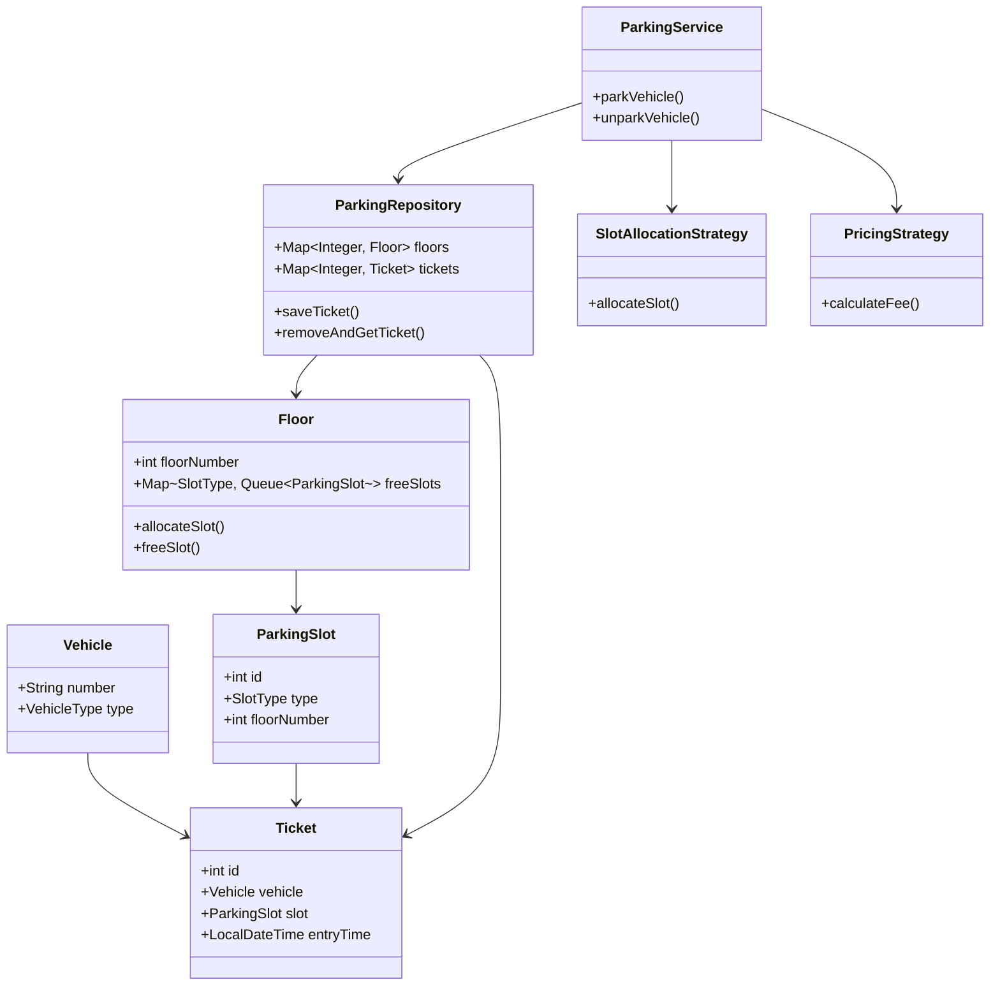

# 🚗 Parking Lot System (Machine Coding - Meesho Style)


---

## ✨ Overview

This project implements a **scalable, thread-safe Parking Lot system** in Java, inspired by real-world backend systems and commonly asked in **Meesho machine coding interviews**.

It demonstrates:

* Clean architecture (Layered Design)
* Efficient data structures (Map + Queue)
* Concurrency handling
* Design patterns

---

## 🚗 Parking Lot System – Low Level Design (LLD)



---

## 🧠 Design Explanation

### 🔹 Flow

```id="flow_parking"
Vehicle → ParkingService → Floor → Slot Allocation → Ticket
                                     ↓
                                Repository
```

---

### 🔹 Key Components

* **Floor**

  * Maintains slots grouped by type
  * Uses `Map<SlotType, Queue<ParkingSlot>>`
  * Handles allocation + freeing
  * Thread-safe using locks

---

* **ParkingRepository**

  * Stores floors and active tickets
  * Uses `ConcurrentHashMap`

---

* **ParkingService**

  * Orchestrates parking/unparking
  * Uses strategies for allocation + pricing

---

* **Ticket**

  * Snapshot of parking event
  * Contains entry time for billing

---

## 🔒 Concurrency Design

| Component       | Approach          |
| --------------- | ----------------- |
| Slot Allocation | Lock per Floor    |
| Ticket Storage  | ConcurrentHashMap |
| Ticket ID       | AtomicInteger     |
| Allocation      | Queue (O(1))      |

---

## 🧠 Design Patterns Used

### ✅ Strategy Pattern

* Slot allocation
* Pricing

---

### ✅ Repository Pattern

* Abstract storage layer

---

## 🔥 Key Design Decisions

* **Queue-based allocation**
  → O(1) slot assignment (no scanning)

* **Floor-level locking**
  → better scalability than global lock

* **Map-based grouping**
  → efficient lookup by slot type

* **Ticket snapshot**
  → avoids recomputation issues

---

## 🎯 Interview Explanation (Use this)

> “Each floor maintains available slots grouped by type using queues for O(1) allocation. I added floor-level locking for thread safety, and used strategy patterns for slot allocation and pricing to keep the system extensible.”

---

## 🚀 Features

* 🏢 Multi-floor parking lot
* 🚘 Supports BIKE, CAR, TRUCK
* ⚡ O(1) slot allocation using Map + Queue
* 🔒 Thread-safe booking using `ReentrantLock` (per floor)
* 🧠 Strategy Pattern for pricing
* 🧵 Concurrency-safe ticket handling using `ConcurrentHashMap`
* 🔢 Atomic ticket ID generation using `AtomicInteger`
* 🧪 Multi-threaded simulation (real-world load)

---

## 🏗️ Architecture

```
Main (Driver / Controller)
   ↓
ParkingService (Business Logic)
   ↓
ParkingRepository (Storage)
   ↓
Floor (Thread-safe allocation)
   ↓
Map<SlotType, Queue<ParkingSlot>>
```

---

## 🧩 Core Components

### 🔹 Models

* `Vehicle`
* `ParkingSlot`
* `Ticket`

### 🔹 Repository

* Stores floors and tickets
* Uses `ConcurrentHashMap` for thread safety

### 🔹 Service Layer

* Handles parking and unparking
* Uses pricing strategy

### 🔹 Floor

* Manages slots per floor
* Uses `ReentrantLock` for concurrency

---

## 🧠 Design Patterns Used

### ✅ Strategy Pattern

Used for pricing logic:

* Hourly pricing
* Can extend to surge / weekend pricing

---

## ⚙️ Concurrency Design

| Component       | Approach                   |
| --------------- | -------------------------- |
| Slot Allocation | `ReentrantLock` per floor  |
| Ticket Storage  | `ConcurrentHashMap`        |
| Ticket ID       | `AtomicInteger`            |
| Unpark          | Atomic remove (`remove()`) |

---

## 🔥 Key Design Decisions

* **Queue-based allocation** → O(1) slot assignment
* **Map-based grouping** → no scanning
* **Per-floor locking** → better scalability than global lock
* **Atomic ticket removal** → prevents race conditions
* **Layered architecture** → clean and extensible

---

## 🧪 Concurrency Testing

Simulated using `ExecutorService` with multiple threads:

Each thread:

1. Tries to park
2. Waits briefly
3. Unparks

### Expected Behavior:

* No duplicate slot allocation ✅
* Some threads may fail if full ✅
* No crashes or race conditions ✅

---

## 📊 Sample Output

```
Thread 0 trying to park
Thread 0 parked at slot 104
Thread 1 trying to park
No slots available
Thread 1 could not find slot
Thread 0 unparked. Fee: 10.0
```

---

## ⚠️ Edge Cases Handled

* No available slots
* Concurrent booking collisions
* Duplicate/unavailable ticket
* Minimum parking fee enforcement

---

## 🧠 Interview Talking Points (VERY IMPORTANT)

You can say:

* “Used Map + Queue for O(1) allocation”
* “Added ReentrantLock per floor for thread safety”
* “Used ConcurrentHashMap for safe shared state”
* “Made unpark operation atomic using remove()”
* “Applied Strategy Pattern for pricing extensibility”

---

## 🔮 Future Enhancements

* 🏢 Multi-floor prioritization (nearest slot)
* 💰 Dynamic pricing (surge / weekend)
* ⏳ Slot reservation with timeout
* 🌐 REST APIs (Spring Boot)
* 🗄️ Database integration
* 📊 Metrics & monitoring

---

## ▶️ How to Run

### Compile

```
javac ParkingLotApp.java
```

### Run

```
java ParkingLotApp
```

---

## 🎯 What This Project Demonstrates

* Strong **Low-Level Design (LLD)**
* Real-world **concurrency handling**
* Practical use of **design patterns**
* Ability to debug **race conditions**

---

## 👩‍💻 Author

Built as part of backend/SDE machine coding preparation.

---
